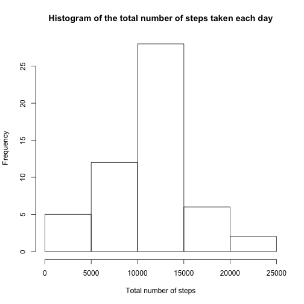
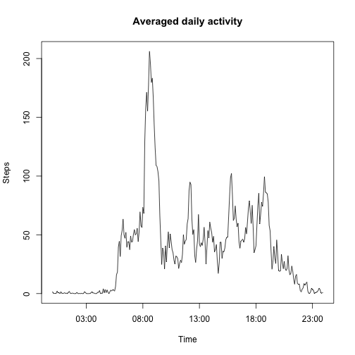
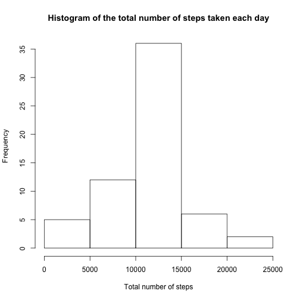
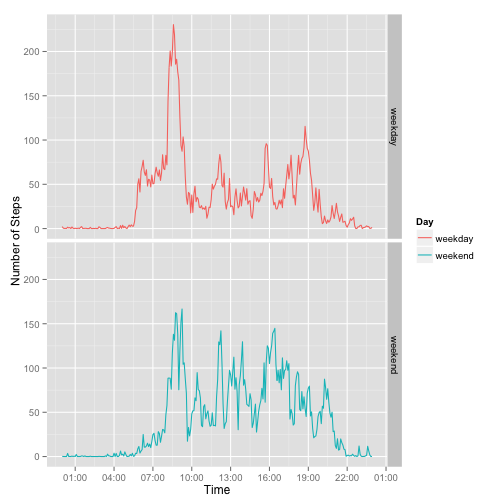

This is for Reproducible Research Course Project1

##1. Loading and preprocessing the data


```r
setwd("/Users/wanhaochi/Desktop/Coursera/reproducible research/courseproject1")
data <- read.csv("activity.csv")
## take a first look at the data
summary(data)
```

```
##      steps                date          interval     
##  Min.   :  0.00   2012-10-01:  288   Min.   :   0.0  
##  1st Qu.:  0.00   2012-10-02:  288   1st Qu.: 588.8  
##  Median :  0.00   2012-10-03:  288   Median :1177.5  
##  Mean   : 37.38   2012-10-04:  288   Mean   :1177.5  
##  3rd Qu.: 12.00   2012-10-05:  288   3rd Qu.:1766.2  
##  Max.   :806.00   2012-10-06:  288   Max.   :2355.0  
##  NA's   :2304     (Other)   :15840
```

```r
str(data)
```

```
## 'data.frame':	17568 obs. of  3 variables:
##  $ steps   : int  NA NA NA NA NA NA NA NA NA NA ...
##  $ date    : Factor w/ 61 levels "2012-10-01","2012-10-02",..: 1 1 1 1 1 1 1 1 1 1 ...
##  $ interval: int  0 5 10 15 20 25 30 35 40 45 ...
```

```r
#pre-processing the data
data$seq <- rep(c(1:61),each = 288)
data$time <- rep(c(1:288),61)
data1 <- na.omit(data)
#change the format 
data1$interval0 <- formatC(data1$interval,width=4,format="d",flag="0")
data1$interval1 <-paste(data1$date,data$interval0)
data1$interval1 <- strptime(data1$interval1,"%Y-%m-%d %H%M")
data1$interval2 <- strptime(data1$interval0, "%H%M")
```

##2. What is mean total number of steps taken per day?


```r
# Calculate the total number of steps taken each day
sum <- with(data1,
            tapply(X=steps,INDEX=seq,FUN=sum,simpilfy = T))

# Make a histogram of the total number of steps taken each day
hist(sum,xlab="Total number of steps",main = "Histogram of the total number of steps taken each day")
```

 

```r
# Calculate and report the mean and median total number of steps taken each day
mean <- mean(sum)
median <- median(sum)
```

The mean total number of steps taken per day is 1.0767189 &times; 10<sup>4</sup>.
The median total number of steps taken per day is 10766.

##3. What is the average daily activity pattern?


```r
mean_interval <- with(data1,
                      tapply(X=steps,INDEX=time,FUN=mean,simpilfy = T))

plot(unique(data1$interval2),mean_interval,type="l",xlab="Time",ylab="Steps",main="Averaged daily activity")
```

 

```r
max <- which.max(mean_interval)
spot <- unique(data1$interval2)
x <- substr(spot[max],start =12, stop =19)
```

08:35:00 5-minute interval, on average across all the days in the dataset, contains the maximum number of steps.

##4.Imputting missing values


```r
#Calculate and report the total number of missing values in the dataset
table(complete.cases(data))
```

```
## 
## FALSE  TRUE 
##  2304 15264
```

The total number of missing values in the datasheet is 2304.


```r
#Fill in all of the missing values with mean value of that 5-min interval in the datasheet.
data2 <- data.frame()
for (i in 1:288) {
    timesub <- subset(data,data$time == i)
    timesub$steps[is.na(timesub$steps)] <- mean_interval[i]
    data2 <- rbind(data2,timesub)
}

#double check the data after imputing the missing data
table(complete.cases(data2))
```

```
## 
##  TRUE 
## 17568
```

```r
str(data2)
```

```
## 'data.frame':	17568 obs. of  5 variables:
##  $ steps   : num  1.72 0 0 47 0 ...
##  $ date    : Factor w/ 61 levels "2012-10-01","2012-10-02",..: 1 2 3 4 5 6 7 8 9 10 ...
##  $ interval: int  0 0 0 0 0 0 0 0 0 0 ...
##  $ seq     : int  1 2 3 4 5 6 7 8 9 10 ...
##  $ time    : int  1 1 1 1 1 1 1 1 1 1 ...
```

```r
# Calculate the total number of steps taken each day in the new dataset
sum2 <- with(data2,
            tapply(X=steps,INDEX=seq,FUN=sum,simpilfy = T))

# Make a histogram of the total number of steps taken each day
hist(sum2,xlab="Total number of steps",main = "Histogram of the total number of steps taken each day")
```

 

```r
# Calculate and report the mean and median total number of steps taken each day
mean2 <- mean(sum2)
median2 <- median(sum2)
```

The mean total number of steps taken per day after imputing the missing data is 1.0767189 &times; 10<sup>4</sup> and before imputing the missing data is 1.0767189 &times; 10<sup>4</sup>.
The median total number of steps taken per day after imputing the missing data is 1.0767189 &times; 10<sup>4</sup> and before imputing the missing data is 10766.

##5.Are there differences in activity patterns between weekdays and weekends?


```r
#change the format
data2$interval0 <- formatC(data2$interval,width=4,format="d",flag="0")
data2$interval <-paste(data2$date,data2$interval0)
data2$interval <- strptime(data2$interval,"%Y-%m-%d %H%M")
data2$interval1 <- strptime(data2$interval0, "%H%M")
data2$date <- strptime(data2$date, "%Y-%m-%d")
data2$day <- weekdays(data2$date)
weekday <- rep("weekday",5)
weekend <- rep("weekend",2)

#Create a new factor variable in the dataset with two levels
data2$weekday <- as.factor(c(rep(c(weekday,weekend),8),weekday))

# Calculate mean for weekday and weekend

data2_weekday <- subset(data2,data2$weekday == "weekday")
data2_weekend <- subset(data2,data2$weekday == "weekend")

mean_interval_weekday <- with(data2_weekday,
tapply(X=steps,INDEX=time,FUN=mean,simpilfy = T))

mean_interval_weekend <- with(data2_weekend,
tapply(X=steps,INDEX=time,FUN=mean,simpilfy = T))
#prepare data for plotting
mean_new <- data.frame(mean_interval_weekday,mean_interval_weekend,time = unique(data2$interval1))
mean_long <- with(mean_new,
                  rbind(data.frame(Day = "weekday",Time = time, Steps = mean_interval_weekday),
                        data.frame(Day = "weekend",Time=time,Steps = mean_interval_weekend))
)

#Plotting
library(ggplot2)
library(scales)
f1 = ggplot(data = mean_long, aes(x = Time, y = Steps,colour = Day) ) +
            geom_line() +
            facet_grid(Day ~ .)+
            ylab("Number of Steps")+
            scale_x_datetime(breaks=date_breaks("3 hour"),labels = date_format("%H:%M"))

print(f1)
```

 
